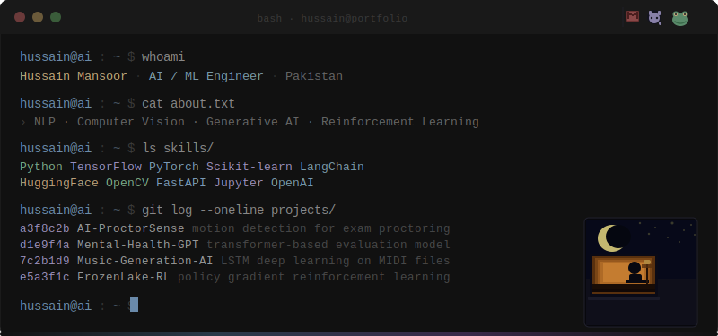

  

 

&nbsp;&nbsp;

&nbsp;&nbsp;

 

── tech stack ──────────────────────────────────────────────────────────

 

  
    
  

 

── stats ────────────────────────────────────────────────────────────

 

  
  

 

── activity ──────────────────────────────────────────────────────────

 

  

 

── projects ──────────────────────────────────────────────────────────

 

  
  
   
  
  
   
  
  

 

  

